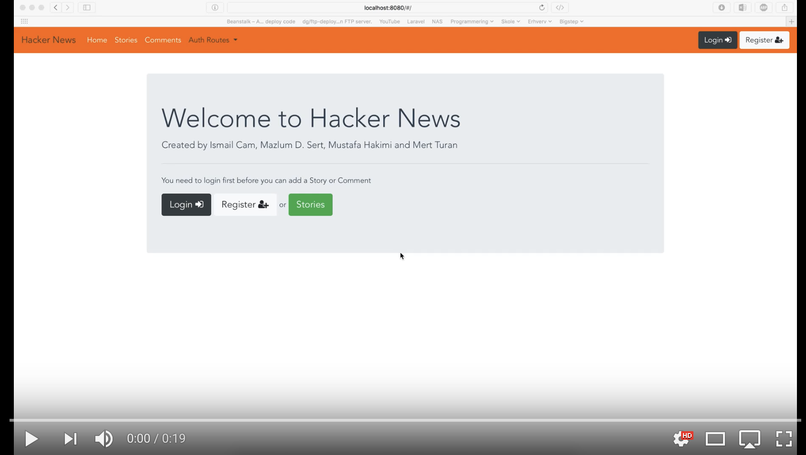
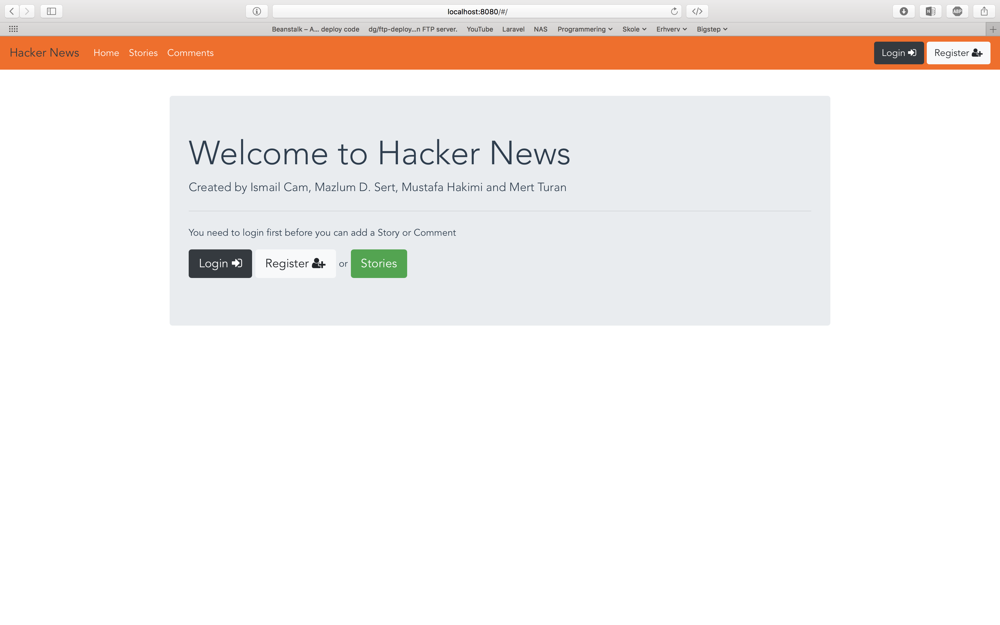
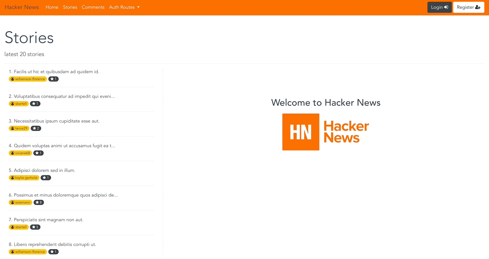
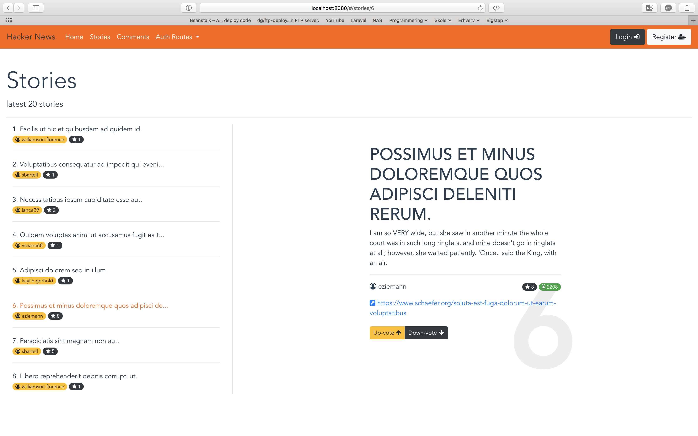
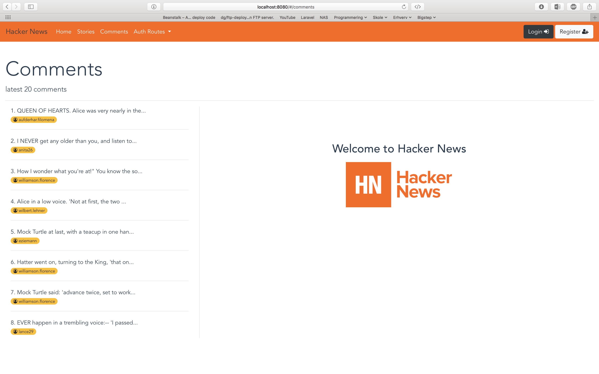
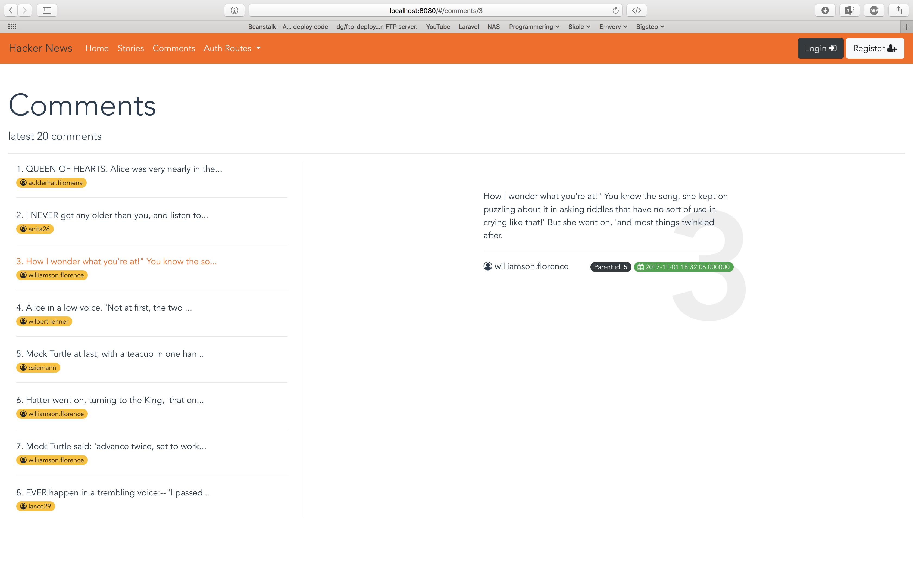
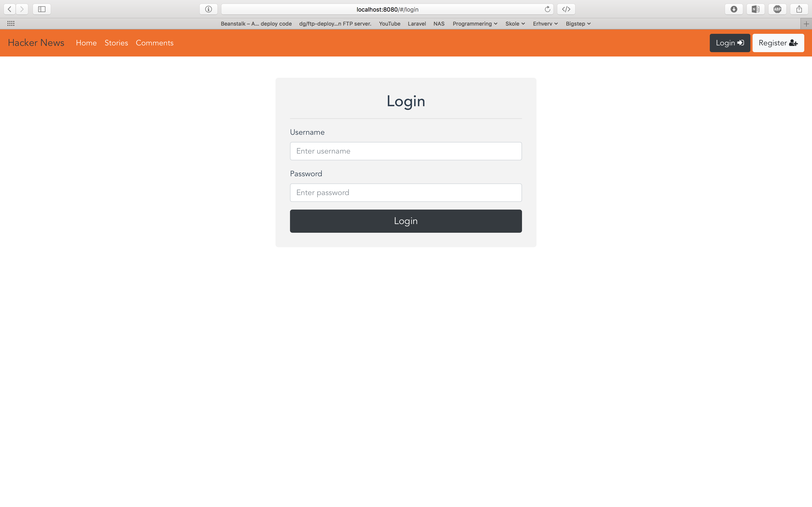
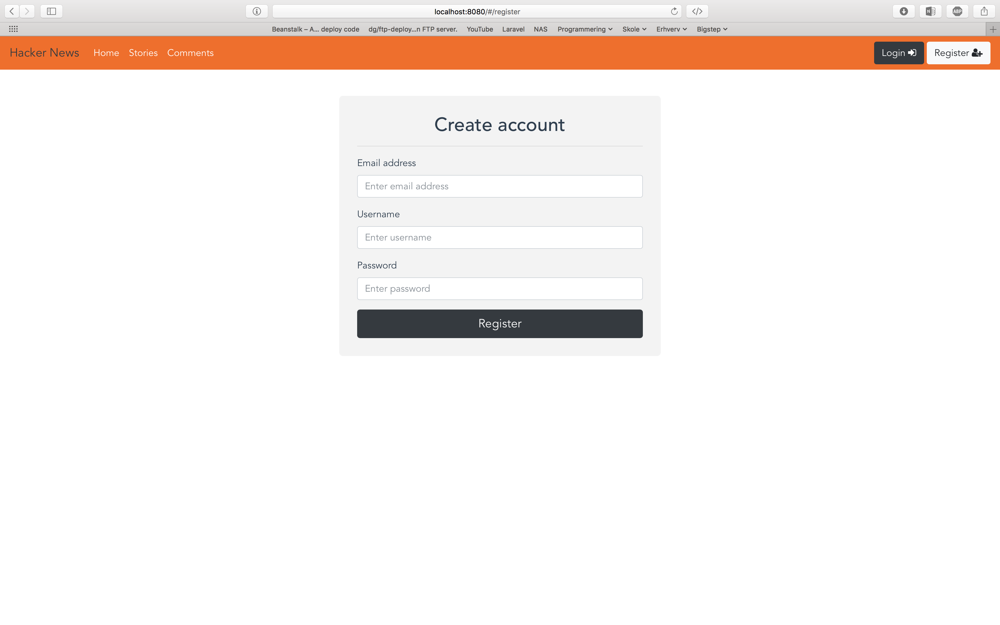
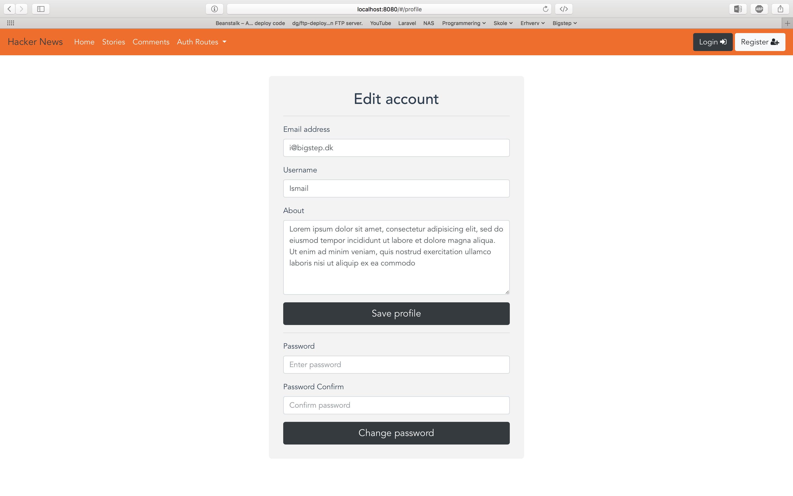
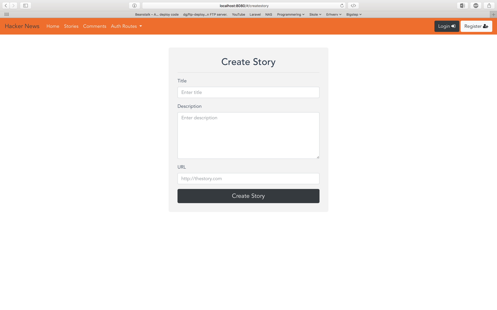

# Hacker News - Front-End
A Vue.js (SPA) project

---

### Build Setup

``` bash
# install dependencies
npm install

# serve with hot reload at localhost:8080
npm run dev

# build for production with minification
npm run build
```

Doc: [docs for vue-loader](http://vuejs.github.io/vue-loader).

---

### Video
<a href="https://www.youtube.com/watch?v=XWNu7SJzyRI" target="_blank">
  
</a>

---

### Screenshots










