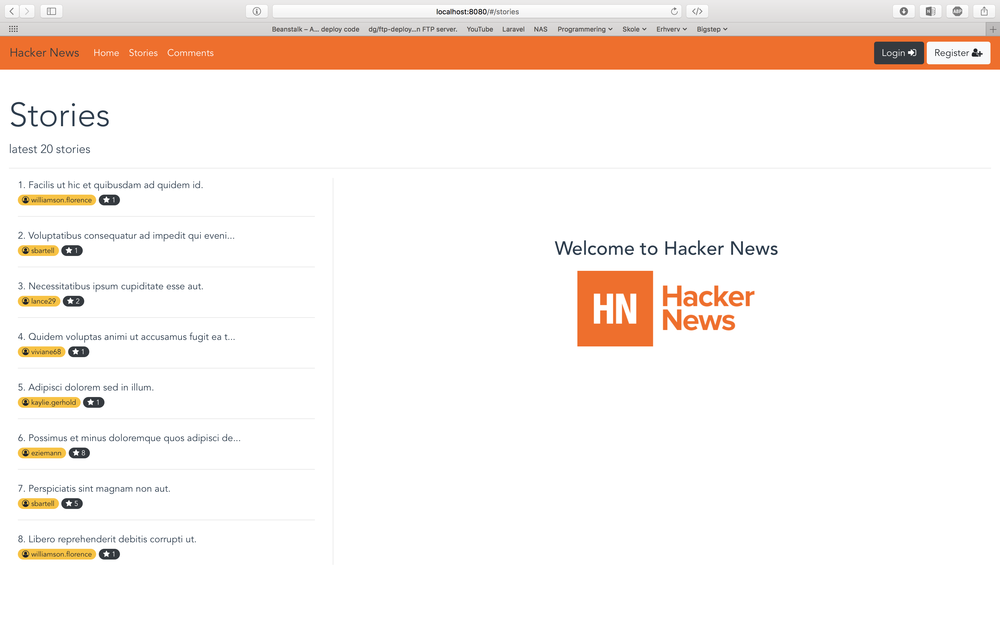

# Hacker News - Front-End
> A Vue.js project

### Build Setup

``` bash
# install dependencies
npm install

# serve with hot reload at localhost:8080
npm run dev

# build for production with minification
npm run build
```

Doc: [docs for vue-loader](http://vuejs.github.io/vue-loader).

---

### Screenshots




